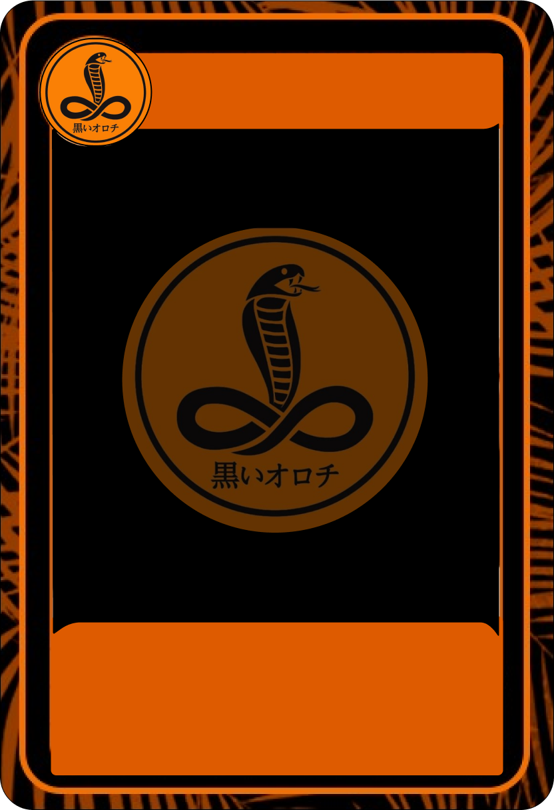

# Kuroi Orochi 🐍 Card: Generator

Esta é uma aplicação baseada na web construída com JavaScript, HTML, jQuery e Bootstrap 6. Ela gera cartões digitais personalizáveis para membros do Clã Kuroi Orochi. Esta ferramenta é ideal para criar e compartilhar rapidamente cartões de clã para comunidades online, jogos de RPG ou uso pessoal.

Características
Cartões de Clã Personalizáveis: Personalize facilmente os detalhes do membro do clã, como nome, rank, atributos e imagens personalizadas.
Design Responsivo: Construído com o Bootstrap 6, garantindo que o gerador de cartões seja totalmente responsivo em diferentes dispositivos.
Pré-visualização ao Vivo: Visualize o cartão em tempo real enquanto personaliza vários elementos.
Interface Simples e Intuitiva: Desenvolvido com jQuery para garantir uma experiência de usuário suave e interativa.
Demonstração

Instalação
Clone o Repositório:

```bash
git clone https://github.com/yourusername/kuroi-orochi-card-generator.git
cd kuroi-orochi-card-generator

```

Abra o arquivo index.html: Abra o arquivo index.html no seu navegador para acessar o gerador localmente.

Alternativamente, use o Live Server:

Instale a extensão Live Server (se estiver usando o Visual Studio Code).
Abra o index.html com o Live Server para recarregar automaticamente as alterações.

## Uso do aplicativo
Preencha os Detalhes do Membro: Use os campos de entrada para inserir o nome, rank e outros atributos pessoais do membro. Selecione ou Envie Imagens: Adicione uma imagem para o membro do clã a partir de um arquivo ou URL. Personalize os Estilos: Ajuste as cores, fontes e layout para combinar com a estética do clã. Gere e Baixe: Quando estiver satisfeito com o design, gere e baixe o cartão como uma imagem.


## Tecnologias Usadas
- JavaScript: Para geração dinâmica e interativa dos cartões. 
- HTML: Para estruturar o layout do gerador de cartões. 
- jQuery: Para manipulação do DOM e interações suaves com o usuário. 
- Bootstrap 6: Para elementos de design responsivos e elegantes.    

## Contribuições
Contribuições Contribuições são bem-vindas! Abra um problema ou envie um pull request com suas melhorias ou novos recursos.

Licença Este projeto é licenciado sob a Licença MIT. Veja LICENSE para mais informações.

Contato Para dúvidas ou feedback, entre em contato com Caique Sarkis.

